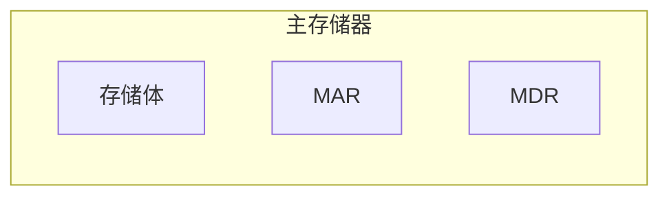

# 简介


​	计算机系统由“硬件”和“软件”两部分组成。

​	项目主要目的是编写软件，所以这里主要以硬件如何执行代码为线索进行介绍。详细内容可参考《计算机组成原理》。


# 计算机硬件框图


```mermaid
graph LR;
  I[输入设备] 
  O[输出设备]
  C[控制器]
  A[运算器]
  M[存储器]
  
  subgraph 
    s1[ ]==数据线==>s2[ ]
  	s3[ ]--控制线-->s4[ ]
  	s5[ ]-.反馈线.->s6[ ]
	
		in[ ]==原始数据==>I
		O==计算结果==>put[ ]
		
	  C --> M
	 	C --> I
	 	C --> A
    C --> O
      
	  M ==> A
    A ==> M
    M ==> C
    I ==> M
    M ==> O
    
    I -.-> C
    O -.-> C
    A -.-> C
    M -.-> C
    
  end
```

​	现代计算机以存储器为中心，由运算器、存储器、控制器、输入设备、输出设备五大部分组成。

​	运算器用来完成算术运算和逻辑运算，存储器用来存放数据和程序，控制器用来控制程序和数据到输入、运行、处理运算结果等。

​	运算器和控制器是CPU的核心部分。



​	主存储器包括存储体、MAR(存储器地址寄存器)、MDR(存储器数据寄存器)。

​	存储体由许多存储单元组成，每个存储单元存放着若干个二进制代码"0"或"1"，MAR用来存放欲访问的存储单元地址，MDR用来存放从存储单元取出或准备往存储单元存入的代码。


​	控制器由CU(控制单元)、IP(指令寄存器)、PC(程序计数器)组成。


